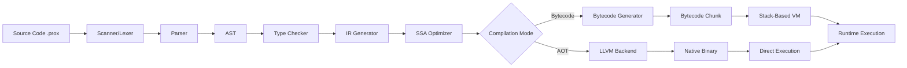

<div align="center"><h1> ProXPL - ProX Programming Language  </h1></div>

<p align="center">
  <b>A Modern, High-Performance Programming Language</b>
</p>

<div align="center">

[](https://opensource.org/licenses/MIT)
[](https://github.com/ProgrammerKR/ProXPL/actions/workflows/build.yml)
[](https://github.com/ProgrammerKR/ProXPL/releases)
[]()


**Clean Syntax • Static Typing • Stack-Based VM • C-Level Performance**

[Quick Start](#-quick-start) •
[Installation](#-installation) •
[Documentation](#-documentation) •
[Architecture](#-architecture-overview) •
[Contributing](#-contributing)

</div>

---

## 📖 Introduction

**ProXPL** (ProX Programming Language) is a modern, statically-typed **systems programming language** designed for **clarity, performance, and reliability**. Born from a vision to combine Python's readability with C's execution speed, ProXPL features a professional **compiler architecture**, a custom **stack-based bytecode VM**, a robust **static type system**, and an integrated **package manager (PRM)**.

ProXPL is implemented entirely in **C/C++** with zero runtime dependencies, making it ideal for **high-performance systems**, **embedded applications**, **game development**, and **backend services**. It serves as an excellent reference for learning **compiler design** and **interpreter implementation**.

### Why ProXPL?

- **🎯 Familiar Syntax**: Clean, expressive syntax inspired by JavaScript and Python
- **⚡ True Performance**: Bytecode compilation to a stack-based VM with LLVM backend for AOT compilation
- **🛡️ Type Safety**: Static typing with intelligent type inference prevents entire classes of runtime errors
- **🔧 Batteries Included**: 75+ built-in standard library functions covering I/O, math, strings, collections, and system operations
- **📦 Integrated Tooling**: Built-in package manager (PRM), CLI tools, and LSP support
- **🏗️ Professional Architecture**: Clean separation between lexer, parser, type checker, compiler, and VM

---

## ✨ Key Features

| Feature | Description |
|---------|-------------|
| 🔤 **Modern Syntax** | JavaScript-like syntax with curly braces, familiar control flow, and clean function definitions |
| 🎨 **ProXPL Icons** | **1100+ File Icons** support via the official extension (Material Icon Theme integration) |
| ⚡ **Fast Execution** | Custom stack-based VM executing optimized bytecode with LLVM AOT compilation support |
| 📦 **Rich Standard Library** | **75+ native functions** for I/O, mathematics, string manipulation, collections, and system tasks |
| 🛡️ **Static Type System** | Compile-time type checking with type inference reduces runtime errors |
| 🧩 **Module System** | Robust `use` keyword for importing standard libraries, packages, and local files |
| 🔧 **PRM Package Manager** | Integrated **ProX Repository Manager** for dependency management and project scaffolding |
| 🏗️ **Multi-Phase Compiler** | Lexer → Parser (AST) → Type Checker → IR Optimizer → Bytecode/LLVM |
| ⏩ **Async/Await** | Native asynchronous programming with LLVM Coroutines support |
| 🔍 **Developer Tools** | CLI with watch mode, LSP for IDE integration, comprehensive error reporting |
| 🎯 **Memory Safety** | Built-in garbage collector with mark-and-sweep algorithm |
| 🌐 **Cross-Platform** | First-class support for Windows, Linux, and macOS |

---

## ⚡ Quick Start

### Your First Program

Create a file named `hello.prox`:

```javascript
// hello.prox
// Your first ProXPL program

func main() {
    print("Welcome to ProXPL!");
    
    let name = input("What is your name? ");
    print("Hello, " + name + "!");
    
    // Generate a random lucky number
    let lucky = random(1, 100);
    print("Here is a lucky number for you: " + to_string(lucky));
}

main();
```

### Run It

Using the ProXPL CLI:
```bash
prox run hello.prox
```

Or using the compiled executable:
```bash
./proxpl hello.prox
```

### Output

```text
Welcome to ProXPL!
What is your name? Alice
Hello, Alice!
Here is a lucky number for you: 42
```

---

## 📥 Installation

### Option 1: Pre-built Binaries (Recommended)

Download the latest release for your operating system:

- **Windows**: [Download `proxpl.exe`](https://github.com/ProgrammerKR/ProXPL/releases/latest)
- **Linux**: [Download `proxpl`](https://github.com/ProgrammerKR/ProXPL/releases/latest)
- **macOS**: [Download `proxpl-macos`](https://github.com/ProgrammerKR/ProXPL/releases/latest)

Add the executable to your system `PATH` for global access.

### Option 2: Build from Source

**Requirements**: 
- C/C++ Compiler (GCC 9+, Clang 10+, or MSVC 2019+)
- CMake 3.15+
- LLVM 10+ (for AOT compilation support)
- Git

**Build Instructions**:

```bash
# Clone the repository
git clone https://github.com/ProgrammerKR/ProXPL.git
cd ProXPL

# Create build directory
mkdir build && cd build

# Configure with CMake
cmake -DCMAKE_BUILD_TYPE=Release ..

# Build the project
make

# Optional: Install system-wide
sudo make install
```

**Windows (Visual Studio)**:
```bash
mkdir build && cd build
cmake -G "Visual Studio 16 2019" ..
cmake --build . --config Release
```

### Option 3: CLI via Node.js (Enhanced Developer Experience)

The ProXPL CLI provides watch mode, better logging, and development conveniences:

```bash
cd src/cli
npm install
npm link
```

Now use the `prox` command globally with enhanced features.

---

## 💻 Language Tour

### Variables & Data Types

ProXPL supports 12 core data types with static type checking:

```javascript
// Primitives
let count = 42;              // Integer
let price = 19.99;           // Float
let active = true;           // Boolean
let message = "Hello!";      // String

// Collections
let numbers = [1, 2, 3, 4, 5];                    // List
let config = {"host": "localhost", "port": 8080}; // Dictionary

// Type inference works automatically
let auto = 100;  // Inferred as Integer
```

### Functions & Control Flow

```javascript
// Function definition
func fibonacci(n) {
    if (n <= 1) return n;
    return fibonacci(n - 1) + fibonacci(n - 2);
}

// Loops and iteration
func main() {
    for (let i = 0; i < 10; i = i + 1) {
        print("fib(" + to_string(i) + ") = " + to_string(fibonacci(i)));
    }
    
    // While loops
    let count = 0;
    while (count < 5) {
        print("Count: " + to_string(count));
        count = count + 1;
    }
}

main();
```

### Working with Collections

```javascript
func demonstrate_collections() {
    // Lists
    let items = [1, 2, 3];
    push(items, 4);           // Add element
    let first = items[0];     // Access by index
    let size = length(items); // Get size
    
    // Dictionaries
    let user = {"name": "Alice", "age": 30};
    user["email"] = "alice@example.com";  // Add key
    let name = user["name"];              // Access value
    
    // Iteration
    for (let i = 0; i < length(items); i = i + 1) {
        print(to_string(items[i]));
    }
}
```

### Module System

ProXPL uses the `use` keyword for modular programming:

```javascript
// Import standard library module
use std.math;

// Import from installed package
use http.client;

// Import local file (relative path)
use local_helper;

func main() {
    let result = std.math.sqrt(16);

    print("Square root of 16: " + to_string(result));
}
```

### Async/Await

ProXPL supports native asynchronous programming:

```javascript
async func fetchUser(id) {
    // Simulate non-blocking operation
    return {"id": id, "name": "User" + to_string(id)};
}

async func main() {
    print("Fetching user...");
    let user = await fetchUser(42);
    print("Got user: " + user["name"]);
}
```

### Standard Library Examples

```javascript
use std.io;
use std.fs;
use std.sys;

func showcase_stdlib() {
    // File I/O
    let content = read_file("data.txt");
    write_file("output.txt", "Hello from ProXPL!");
    
    // String operations
    let text = "ProXPL is awesome";
    let upper = to_upper(text);
    let parts = split(text, " ");
    
    // Math operations
    let result = sqrt(144);
    let power = pow(2, 8);
    let random_num = random(1, 100);
    
    // System operations
    let env_var = env("PATH");
    let current_time = time();
}
```

### Foreign Function Interface (FFI)

ProXPL can invoke native C functions from dynamic libraries (`.dll`, `.so`) using the `extern` keyword.

```javascript
// Load C standard library
extern "msvcrt.dll" "puts" func c_puts(text);
extern "msvcrt.dll" "abs" func c_abs(n);

c_puts("Hello from C!");
let dist = c_abs(-100);
```

---

## 📦 Package Manager (PRM)

ProXPL includes **PRM** (ProX Repository Manager), a built-in package manager for dependency management and project scaffolding.

### Basic Commands

```bash
# Initialize a new project
prm init my-project

# Install a package
prm install http-server

# List installed packages
prm list

# Search for packages
prm search json

# Update dependencies
prm update

# Remove a package
prm remove old-package
```

### Project Structure (`prox.toml`)

```toml
[package]
name = "my-web-server"
version = "1.0.0"
authors = ["Your Name <you@example.com>"]
edition = "2025"
description = "A fast web server built with ProXPL"
license = "MIT"

[dependencies]
http_parser = "2.1.0"
json = "1.5.0"

[build]
target = "native"
optimize = true
```

---

## 🏗️ Architecture Overview

ProXPL follows a professional multi-phase compiler architecture designed for maintainability, extensibility, and performance.



### Core Components

| Component | Location | Responsibility |
|-----------|----------|----------------|
| **Scanner/Lexer** | [`src/lexer/scanner.c`](src/lexer/scanner.c) | Tokenizes source code into lexical tokens |
| **Parser** | [`src/parser/parser.c`](src/parser/parser.c) | Builds Abstract Syntax Tree (AST) from tokens |
| **Type Checker** | [`src/compiler/type_checker.c`](src/compiler/type_checker.c) | Validates types and enforces type safety |
| **IR Generator** | [`src/compiler/ir_gen.c`](src/compiler/ir_gen.c) | Generates intermediate representation (SSA form) |
| **IR Optimizer** | [`src/compiler/ir_opt.c`](src/compiler/ir_opt.c) | Performs optimizations on SSA IR |
| **Bytecode Compiler** | [`src/compiler/bytecode_gen.c`](src/compiler/bytecode_gen.c) | Emits optimized bytecode instructions |
| **LLVM Backend** | [`src/compiler/backend_llvm.cpp`](src/compiler/backend_llvm.cpp) | Generates LLVM IR for AOT native compilation |
| **Virtual Machine** | [`src/runtime/vm.c`](src/runtime/vm.c) | Stack-based VM that executes bytecode |
| **Garbage Collector** | [`src/runtime/gc.c`](src/runtime/gc.c) | Mark-and-sweep GC for automatic memory management |
| **Memory Manager** | [`src/runtime/memory.c`](src/runtime/memory.c) | Low-level memory allocation and tracking |
| **Standard Library** | [`src/stdlib/`](src/stdlib/) | Native implementations of 75+ built-in functions |

### Compilation Pipeline

1. **Lexical Analysis**: Source code is tokenized into meaningful symbols
2. **Syntax Analysis**: Tokens are parsed into an Abstract Syntax Tree
3. **Semantic Analysis**: Type checking and semantic validation
4. **IR Generation**: AST is lowered to SSA-based intermediate representation
5. **Optimization**: IR optimizations (constant folding, dead code elimination, etc.)
6. **Code Generation**: 
   - **Bytecode Path**: Generate bytecode for VM execution
   - **Native Path**: Generate LLVM IR → native binary via LLVM
7. **Execution**: Run on the stack-based VM or execute native binary

---

## 📂 Project Structure

```text
ProXPL/
├── include/                  # Public header files
│   ├── vm.h                  # Virtual machine interface
│   ├── compiler.h            # Compiler interface
│   ├── ast.h                 # AST node definitions
│   ├── stdlib_native.h       # Standard library declarations
│   └── gc.h                  # Garbage collector interface
├── src/
│   ├── main.c                # Entry point
│   ├── lexer/                # Lexical analysis
│   │   └── scanner.c
│   ├── parser/               # Syntax analysis
│   │   ├── parser.c
│   │   └── ast.c
│   ├── compiler/             # Code generation
│   │   ├── type_checker.c
│   │   ├── ir_gen.c
│   │   ├── ir_opt.c
│   │   ├── bytecode_gen.c
│   │   └── backend_llvm.cpp
│   ├── runtime/              # Runtime system
│   │   ├── vm.c              # Virtual machine
│   │   ├── gc.c              # Garbage collector
│   │   ├── memory.c          # Memory management
│   │   ├── chunk.c           # Bytecode storage
│   │   └── object.c          # Runtime object system
│   ├── stdlib/               # Standard library (native)
│   │   ├── stdlib_core.c
│   │   ├── stdlib_io.c
│   │   ├── stdlib_math.c
│   │   └── stdlib_string.c
│   ├── prm/                  # Package manager
│   │   ├── manifest.c
│   │   └── builder.c
│   └── utils/                # Utilities
│       └── error_report.c
├── lib/std/                  # Standard library (ProXPL)
├── tools/
│   ├── lsp/                  # Language Server Protocol
│   ├── bench/                # Benchmarking tools
│   └── prm_main.c            # PRM CLI entry
├── examples/                 # Example programs
├── tests/                    # Test suite
├── docs/                     # Documentation
│   ├── language-spec/        # Language specification
│   ├── stdlib/               # Standard library docs
│   └── architecture/         # Architecture guides
├── benchmarks/               # Performance benchmarks
├── CMakeLists.txt            # Build configuration
├── Makefile                  # Alternative build system
└── README.md                 # This file
```

---

## 📚 Documentation

Comprehensive documentation is available in the [`docs/`](docs/) directory:

- **[Language Specification](docs/spec.md)**: A detailed guide to ProXPL grammar, keywords, operators, data types, and core semantics.
- **[Standard Library Reference](docs/stdlib/)**: Detailed documentation for all built-in functions and modules.
- **[Architecture Guide](docs/architecture/)**: A deep dive into the compiler design and Virtual Machine (VM) internals.
- **[IR Specification](docs/ir-spec/)**: Documentation for the SSA (Static Single Assignment) intermediate representation.
- **[Build Guide](CONTRIBUTING.md)**: Platform-specific instructions for building ProXPL from source.
- **[Coding Standards](CODING_STANDARD.md)**: Code style guidelines and contribution workflow.
- **[Benchmarks](BENCHMARKS.md)**: Performance metrics, comparisons, and optimization notes.
- **[Ecosystem Design](ECOSYSTEM_DESIGN.md)**: Overview of the Standard Library and PRM (ProX Package Manager) architecture.

---


---

## 🧪 Testing

Run the comprehensive test suite:

```bash
# Build with tests enabled
cmake -DCMAKE_BUILD_TYPE=Debug -DBUILD_TESTS=ON ..
make

# Run all tests
make test

# Run specific test
./build/tests/lexer_test
./build/tests/parser_test
./build/tests/vm_test
```

---

## 🚀 Performance

ProXPL is designed for high performance through multiple optimization layers:

- **Zero-cost abstractions**: High-level features compile to efficient low-level code
- **SSA-based optimizations**: Constant folding, dead code elimination, common subexpression elimination
- **Bytecode JIT potential**: Foundation for future JIT compilation
- **LLVM backend**: Leverages industry-standard optimizer for native performance
- **Efficient GC**: Mark-and-sweep with tri-color marking (planned)

See [BENCHMARKS.md](BENCHMARKS.md) for detailed performance comparisons.

---

## 🗺️ Roadmap

- **v0.5.0 (Alpha)**: Core language features (variables, functions, control flow). ✅
- **v0.8.0**: Advanced memory management, closures, upvalues. ✅
- **v0.9.0**: Standard Library (fs, time, gc), IO improvements. ✅
- **v1.0.0 (Current)**:
  - **Object-Oriented Programming**: Classes, Methods, Inheritance, Properties.
  - **Keywords**: `class`, `new`, `this`, `extends`, `interface`.
  - **Runtime**: Optimized VM with Object Support.
- **v1.1.0** (Planned): 
  - Advanced Strings/Lists.
  - Exception Handling (`try`/`catch`).
  - Module System refinements.
- **v1.2.0**: Native Interface (FFI) full stability.

### v1.0.0 (Current - Alpha)
**Status**: Released
- ✅ **Class-based OOP**: First-class support for Classes, Objects, Inheritance, and Interfaces.
- ✅ **Runtime Architecture**: Enhanced VM with Class, Instance, and BoundMethod support.
- ✅ **New Keywords**: `class`, `new`, `this`, `extends`, `interface`, `static`.
- ✅ **Inheritance**: Single inheritance model with superclass method lookup.
- ✅ **Verification**: Verified via `tests/oop_v1.0.0.prox`.

### v1.1.0 (Upcoming)
**Status**: Planned
- 📋 **Access Control**: `pub`/`priv` visibility enforcement.
- 📋 **Constructors**: `init` constructor method.
- 📋 **Exception Handling**: `try`/`catch` blocks.

### Future Roadmap (2026+)
- 📋 **v1.2.0**: FFI Stability & ProX Studio Alpha.
- 📋 **v1.3.0**: Pattern Matching, Enums, Generics.
- 📋 **v2.0.0**: Async/Await, WebAssembly, JIT.

## 🛠️ Contributing

We warmly welcome contributions! ProXPL is an excellent project for learning compiler design, language implementation, and systems programming.

### How to Contribute

1. **Fork** the repository
2. Create a feature branch (`git checkout -b feature/amazing-feature`)
3. Follow the [Coding Standards](CODING_STANDARD.md)
4. Write tests for new features
5. Commit your changes (`git commit -m 'Add amazing feature'`)
6. Push to the branch (`git push origin feature/amazing-feature`)
7. Open a **Pull Request**

### Areas for Contribution

- 🐛 Bug fixes and stability improvements
- ✨ New standard library functions
- 📝 Documentation and tutorials
- 🧪 Test coverage expansion
- ⚡ Performance optimizations
- 🎨 IDE and editor plugins
- 📦 Community packages

Please read [CONTRIBUTING.md](CONTRIBUTING.md) for detailed guidelines and [CODE_OF_CONDUCT.md](CODE_OF_CONDUCT.md) for community standards.

---

## 📄 License

This project is licensed under the ProXPL Professional License - see the [LICENSE](LICENSE) file for details.

---

<p align="center">
  <b>Built with ❤️ by the ProXPL Community</b><br>
  <i>Making programming easy, accessible and enjoyable</i>
</p>

<p align="center">
  <sub>ProXPL - A Modern Programming Language for the Future</sub>
</p>

